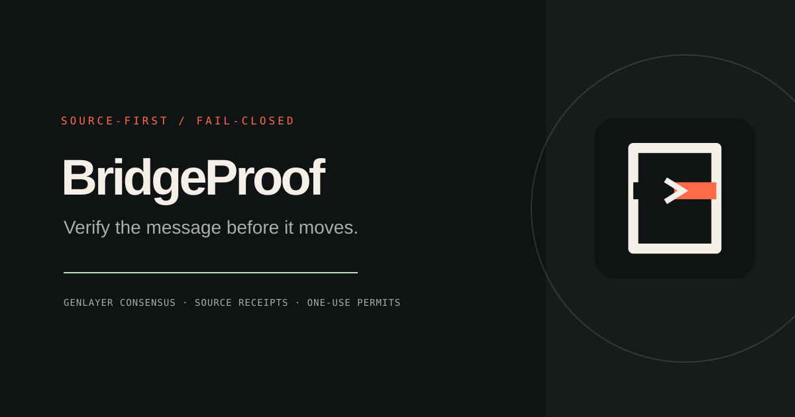

# BridgeProof



BridgeProof is a wallet-connected product for verifying source-chain transaction receipts before a guarded on-chain action is released.

It is intended for bridge operators, relayers, protocol teams, and autonomous agents that need more than a relayer's assertion that a source-chain transaction succeeded. BridgeProof binds a claim to a source chain, transaction hash, sender, recipient, transaction-input commitment, value, nonce, and finality requirement. GenLayer validators independently inspect the declared authoritative transaction and logs endpoints and decide whether the complete receipt matches before a one-use execution permit can be consumed.

BridgeProof v1 is deliberately scoped to **transaction-receipt verification**. It does not decode or prove a protocol-specific bridge-message event. A team that needs event-level bridge semantics must add a fixed event schema and verify its emitting contract, topics, and decoded data before treating the result as a bridge-message proof.

## Product promise

Users should be able to:

1. Connect a browser wallet.
2. Create or select a guarded destination target.
3. Submit a real source-chain transaction-receipt claim.
4. See the claim move through wallet signing, GenLayer consensus, approval or rejection, permit consumption, and finalization.
5. Understand exactly which fields matched, which source evidence was used, and why an action was blocked.

There will be no seeded accounts, fabricated receipts, local-only success paths, or UI states that imply finality before the underlying transaction and contract state confirm it.

When creating a proof, the operator pastes the source transaction hash. BridgeProof reads the configured transaction and logs endpoints, normalizes the receipt fields, and derives the payload commitment from the transaction input before the operator signs the claim. The populated values remain editable so deliberate mismatch cases can still be tested.

## Current status

The original positive lifecycle, adversarial rejection path, and Rabby refresh/reconnect behavior were proven on StudioNet against a live Sepolia receipt. The hardened contract additionally reserves each `(source_chain_id, tx_hash)` after its first approval, rechecks target activation and version at permit consumption, and makes the guarded executor repeat those checks at execution start and finalization. The corrected contracts require a fresh StudioNet deployment before the new lifecycle can be represented as live evidence.

- [Open BridgeProof](https://bridgeproof-shalyxs-projects.vercel.app/)
- [View the original public proof](https://bridgeproof-shalyxs-projects.vercel.app/proofs/proof-muycwo6h)

See the [live test report](docs/live-test-report.md), [product specification](docs/product-spec.md), and [contract boundary](docs/contract-boundary.md) for the public implementation notes.

## Local development

Requirements: Python 3.11+, Node.js 20+, and a browser wallet for live writes.

```powershell
python -m pip install -r requirements.txt
python -m pytest -p no:cacheprovider tests/direct -q
python -m genvm_linter.cli lint --json contracts/bridge_proof.py
python -m genvm_linter.cli validate --json contracts/bridge_proof.py

npm install
npm test
npm run build
npm run dev
```

Copy `.env.example` to `.env.local` and provide deployed contract addresses before attempting a wallet write. With blank addresses the application intentionally stays read-only and visibly reports that deployment is not configured.

## Proposed product shape

The product will contain:

- a GenLayer Intelligent Contract that owns the proof lifecycle and issues one-use permits;
- a guarded executor that can only perform the protected destination action after permit consumption;
- a wallet-connected web application for operators and relayers;
- public proof-detail pages that expose verified state without requiring a wallet;
- deployment, test, and evidence tooling sufficient for another builder to reproduce the flow.

The first release will target one verified source-chain integration and one GenLayer deployment. Additional chains are explicitly out of scope until the first integration passes the production gates.

## Non-goals for the first release

- acting as a universal bridge;
- custodying user funds or private keys;
- trusting client-provided receipt data as authoritative;
- supporting many chains before one complete flow is reliable;
- claiming protocol-specific bridge-event verification without a fixed event schema;
- presenting a simulator as a live deployment;
- submitting the project before the live user path and failure cases are proven.
